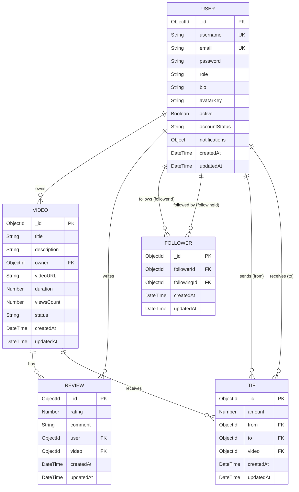

# ClipSphere ER Diagram

## Entity-Relationship Diagram

## Relationships Summary

| Relationship | Type | Description |
|---|---|---|
| User → Video | One-to-Many | A user owns many videos |
| User → Review | One-to-Many | A user writes many reviews |
| Video → Review | One-to-Many | A video has many reviews |
| User → Follower | One-to-Many | A user can follow many users |
| User → Follower | One-to-Many | A user can be followed by many users |
| User → Tip | One-to-Many | A user can send and receive many tips |
| Video → Tip | One-to-Many | A video can receive many tips |

## Constraints

- **User**: `username` and `email` are unique
- **Review**: Compound unique index on `(user, video)` — one review per user per video
- **Follower**: Compound unique index on `(followerId, followingId)` — no duplicate follows
- **Follower**: Pre-save hook prevents self-following (`followerId !== followingId`)
